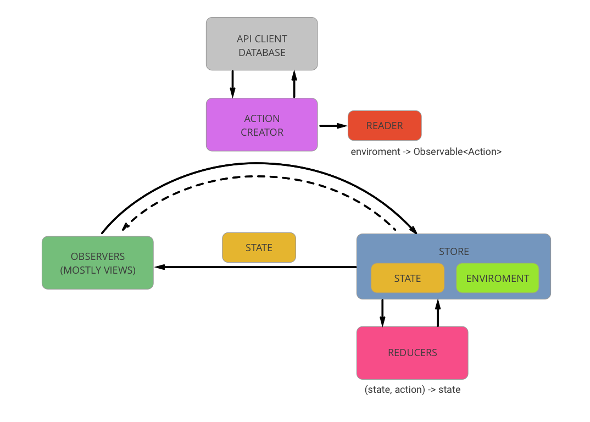

# Cachopo
Proof of concept for Cachopo: A Rx + Redux framework for Swift


## Dispatching
```swift
rxStore.dispatch(MyAction)
```

## Subscribing

```swift
rxStore.observable { $0.substate }
  .subscribeNext {
    print("Substate: \($0)")
  }
```

## Async Actions

```swift
struct SetSearchResults:Action {
  let artists:[Artist]
}

func searchArtists(searchString:String) -> Reader<Enviroment, Observable<Action>>
{
    return Reader<Enviroment, Observable<Action>>{ state, enviroment in

        return enviroment.service.load(Artist.matching(searchString))
            .map { SetSearchResults(artists: $0) }   

    }
}
```

## The Reader Monad

```swift
public class Reader<E, A> {

    let g: (E) -> A

    init(_ g:(E) -> A) {
        self.g = g
    }

    func run(e: E) -> A {
        return g(e)
    }

    func map<B>(f:(A) -> B) -> Reader<E, B> {
        return Reader<E, B>{ e in f(self.g(e)) }
    }
    func flatMap<B>(f:(A) -> Reader<E, B>) -> Reader<E, B> {
        return Reader<E, B>{ e in f(self.g(e)).g(e) }
    }
}
```

[More info](https://medium.com/@foolonhill/techniques-for-a-functional-dependency-injection-in-swift-b9a6143634ab)

## Cachopo Dispatch Feedback

```swift
public func dispatch(asyncAction:AsyncAction) -> Observable<Void>


rxStore.dispatch(action)
  .trackActivityUI(showActivityIndicator)
  .catchError(handleError)
  .subscribe()
  .addDisposableTo(disposeBag)
```

## Diagram


